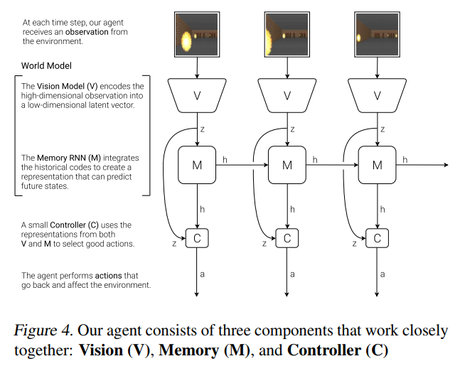
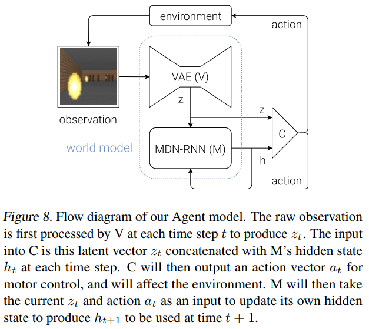
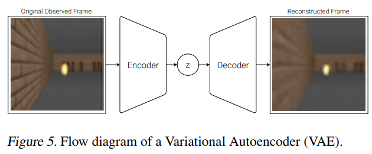
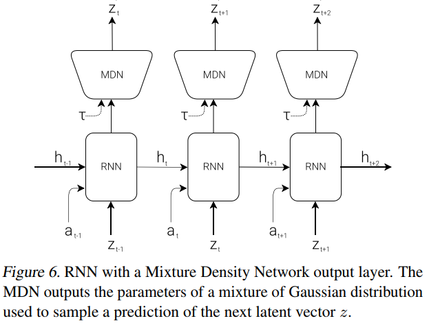
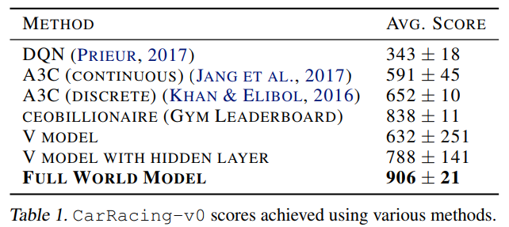
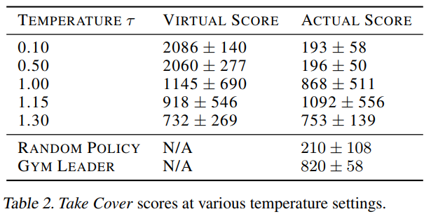

# [World Models](https://arxiv.org/pdf/1803.10122.pdf)

##### TL;DR

###### Idea:

By combining vision, memory, and control models, the agents can train with much larger networks than regular RL networks. That means, this world models have much more parameters to represent data. Also they have trained evolution strategies instead of reinforcement learning in control module. They have experimented with `car-racing` and `vizdoom` environments.

###### Combined model:

###### Vision:

###### Memory:

###### Experiments:

###### And more:

In the last section of this paper, they have provided interesting articles (most of them are Schumidhuber's). They are definitely worth to read!!
